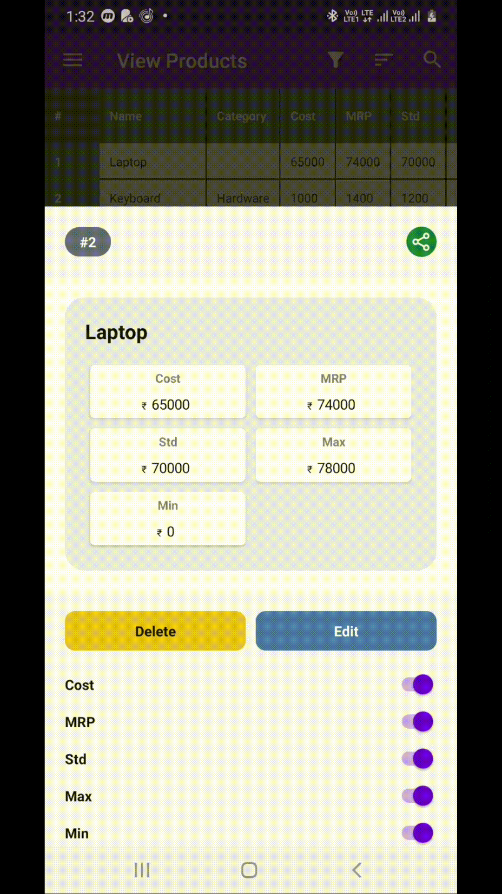

# RearrangingGridLayout

A GridLayout based on AndroidX GridLayout that rearranges itself on child change.

## Sample

## Implementation
**Step 1:** Add to project level build.gradle

    allprojects {
		repositories {
			...
			maven { url 'https://jitpack.io' }
		}
	}

**Step 2:** Add to app level build.gradle

	dependencies {
        implementation 'androidx.gridlayout:gridlayout:1.0.0' // GridLayout
	    implementation 'com.github.u-barnwal:RearrangingGridLayout:VERSION'
	}
## How to use
**Step 1:** Create view

    <com.isolpro.library.rearranginggridlayout.RearrangingGridLayout  
	  android:layout_width="match_parent"  
	  android:layout_height="wrap_content"  
	  app:columnCount="2">  
	  ...
	</com.isolpro.library.rearranginggridlayout.RearrangingGridLayout>
**Step 2:** Save all the children of the GridLayout after it is bound (rendered), like below

	@Override
	protected void onCreate(Bundle savedInstanceState) {
	    super.onCreate(savedInstanceState);
	    setContentView(R.layout.activity_home);

	    RearrangingGridLayout rglPrices = findViewById(R.id.rglPrices);
	    
	    rglPrices.saveViews();
	}
**Step 3:** To hide a child view

    rglPrices.hideViewAtIndex(indexOfView);

**Step 2:** To show a child view

    rglPrices.showViewAtIndex(indexOfView);

## Features

 - Doesn't show empty space for hidden element
 - Maintains original view order
 - Doesn't re-render any view
 - Super fast

## Links
 - More info: https://stackoverflow.com/a/65402196/4437468
 - Live example: https://pricelistlite.isolpro.in
